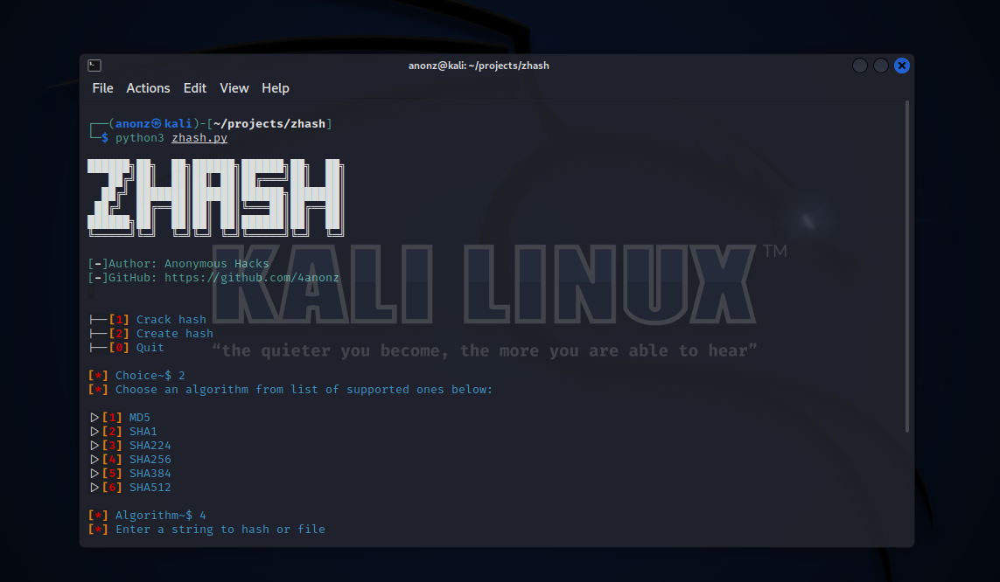
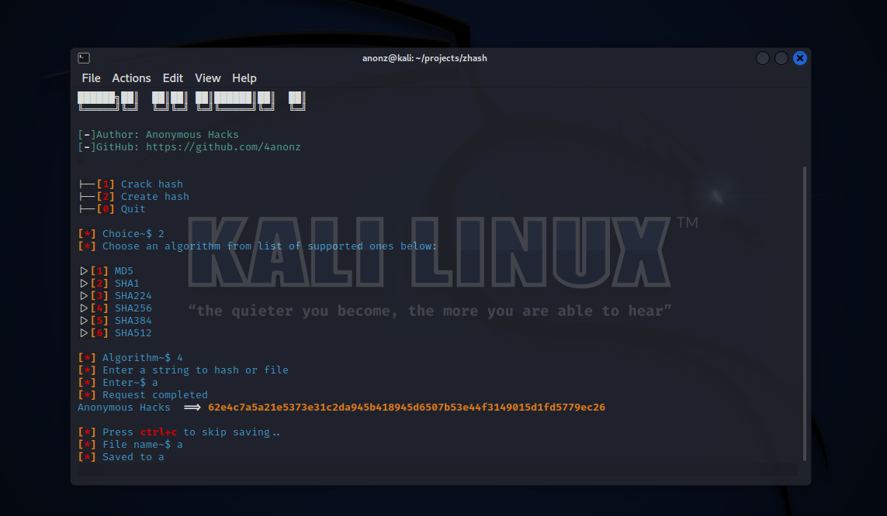

# zhash
zhash is a simple python tool which allows you to crack/create hashes.
Below are the list of supported algorithms that zhash can crack

# Supported Algorithms
* MD5
* SHA1
* SHA224
* SHA256
* SHA384
* SHA512

In this repository there's a [crack_me.txt](crack_me.txt) which you can use to
test the tool.

As usual.. always.. use this tool ethically(for learning purposes only)

# Screenshots

